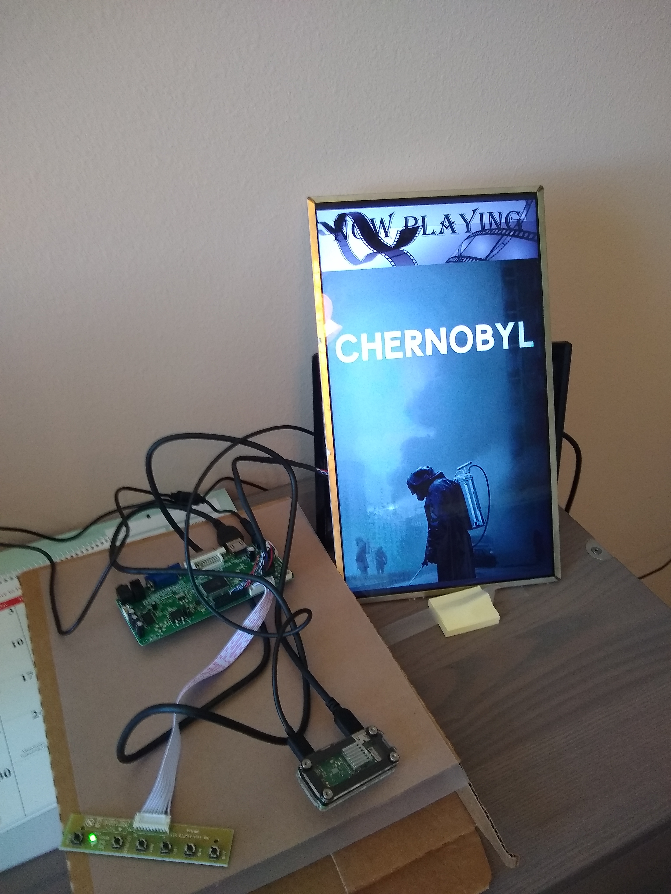
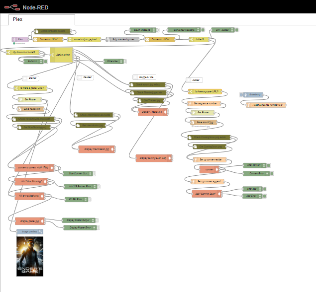

# Plex-Poster-Display
A project using MQTT and a Raspberry Pi Zero-W to create a wall mounted poster display that automatically updates with Plex activity.  
Consider this a proof-of-concept that you may adapt to your specific needs.  



## Features
- Starting or resuming an episode or movie will download and display the associated poster with a "Now Playing" header (example included).
- Pausing will display an "Intermission" image (example included).
- Stopping, or completing to a "Watched" state will display a slideshow of several recently added items with "Coming Soon" headers.  If no slideshow files exist, uses "Theater" image (example included).
- Adding media will automatically download the associated poster, add the "Coming Soon" header (example included), and save file for slideshow.
- Uses RAMdisk to avoid multiple writes to SD card.
- Checks for static files on RAMdisk, and pulls from /home/pi/ if needed (Headers survive reboot, posters do not).

## "Requirements":
There are certainly other ways to accomplish this goal.  These are the "requirements" to duplicate the path I took.
1. Plex Server    <https://plex.tv>
2. Tautulli       <https://tautulli.com/>
3. Raspberry Pi Zero-W 
- Raspbian Lite
- MQTT Broker   
- Node-Red
- FBI (FrameBuffer Image viewer)
- Image Magick (image modification)
4. Display monitor 
- I'm using a salvaged 768x1366 display from a broken laptop (LTN156AT05-U09), with a driver board from eBay (search for your display part number + "driver"; usually about $30). 
- The images and commands used are often specific to that resolution, but can be easily changed.
- I'll be framing my display and hanging it at the entrance to my media room, but this could go anywhere you can power it and get a WiFi signal.

## Plex Server
This project assumes you have a working Plex server.  Setup of Plex is beyond the scope of this project.

## Tautulli
This project assumes you have a working Tautulli installation that is getting information from your Plex server.  I will only cover the project-specific setup here.  I can't remember if using Cloudinary is standard in Tautulli, but you will need that, too.  I may have set up Cloudinary when I set up my weekly user newsletter.
Unless you already have an MQTT broker available, you will want to set that up first, before configuring Tautulli MQTT notifications.

1. Set up an MQTT notification agent.  
   This is pretty simple.  Just go into the "Notification Agents" section on Tautulli and add an MQTT agent with the appropriate info for your MQTT broker.  Remember the Topic for later use (I used "Plex").
   
2. Configure the MQTT messages.  
   On the "Text" tab of the notification agent setup, change the text for the six messages used in this project.
   - Playback Start
   - Playback Stop
   - Playback Pause
   - Playback Resume
   - Watched
   - Recently Added
   
   Tautulli can send a huge amount of info; I encourage you to see what's available and how it can be formatted by clicking the links at the top of the "Text" tab. I went for the shotgun approach for now.  I send a lot of headers, but they may be empty.  The Node-Red flow only uses "user", "action", and "poster_url", so the rest could actually be eliminated.
   
   I configured each of the above messages with the same basic output:
   ```JSON
   "user":"{user}", "action":"started", "type":"{media_type}", "title":"{title}", "episode":"S{season_num00}E{episode_num00}", "year":"{year}", "poster_url":"{poster_url}"
   ```
   All of the quotes are necessary so that Node-Red can format (deserialize) this into a JSON object.  The "action" is the only thing I changed for each message:
   * started
   * stopped
   * paused
   * resumed
   * watched
   * added

## Raspberry Pi
   This should work with any Linux-based computer.  The compute power requirement is quite low; there might just be a little slowdown on the image processing for slower computers.  I am using a Raspberry Pi Zero-W with a mini-HDMI to HDMI cable, which has similar power to an older Raspberry Pi 2B.
   
1. Install the latest Raspbian Lite <https://www.raspberrypi.org/downloads/raspbian/>.  This project does not need a desktop interface.
2. For simplicity, I enabled SSH on first boot by creating a blank file named "ssh" (no extention) on the "boot" partition of the micro-SD card.  
I also configured wifi on first boot by adding a "wpa_supplicant.conf" file to the "boot" partition (it will be moved on boot).  Here is the format for that file:  
```
country=US
ctrl_interface=DIR=/var/run/wpa_supplicant GROUP=netdev
update_config=1

network={
    ssid="NETWORK-NAME"
    psk="NETWORK-PASSWORD"
}
```
3. For my screen, I had to rotate the display.  
* Add the following to the "config.txt" file in the "boot" partition:  
```
# Rotate Display
# 0 is the normal configuration. 1 is 90 degrees. 2 is 180 degress. 
# 3 is 270 degrees.
display_rotate=3
```
4. Boot and perform the usual updates / upgrades.
5. Create a mount point, and configure to create RAMdisk on boot.  I used this to prevent frequent writes to the micro-SD card, which can wear it out.
* Make the directory /mnt/rd (`md /mnt/rd`)
* Edit /etc/rc.local and add the following:  
```
# Autocreate ramdisk
/sbin/mke2fs -q -m 0 /dev/ram0
/bin/mount /dev/ram0 /mnt/rd
/bin/chown pi:root /mnt/rd
/bin/chmod 0750 /mnt/rd
```
6. Install Node-Red in whatever manner you like (I used `sudo apt-get install node-red`).
7. Install FBI in whatever manner you like (I used `sudo apt-get install fbi`).
8. Install Image Magick in whatever manner you like (I used `sudo apt-get install imagemagick`).
9. Add image files from the "PlexPosterGraphics" folder to `/home/pi/`.  You may use the examples I have supplied, but you'll probably want to create some to fit your display.
   
### MQTT Broker
1. You will need an MQTT broker to handle the messages (e.g. Mosquitto <https://mosquitto.org/>).  The broker does not have to be on this Raspberry Pi (mine is not), but it can be.  Installing an MQTT broker is simple, but I will not cover it here.  (I may add this in the future for completeness.)

### Node-Red


1. Open Node-Red in a browser (by default, this should be: `http://[IP_ADDRESS_OF_YOUR_PI]:1880`).
2. Add extra nodes; FS-Ops to make sure the right files are in the RAMdisk, image-output to show an image
* Select "Manage palette" from the menu at the top, right
* Select the "Install" tab
* Search for "FS-Ops" and click "install"
* Search for "image-output" and click "install" (This is optional. It just shows an image on the Node-Red page, but it's good for debugging. You can just delete it from the flow, if you like.)
3. Import the flow.
* In Node-Red, select "Import", then "clipboard" from the menu at the top, right
* Click "select a file to import" and choose "PlexPosterFlow.json"
* Click in the window to anchor the imported flow
4. Edit the flow to match your build. (See flow discussion below for what you might have to edit. You'll definitely need to edit the user name or remove that check.)

### Flow Discussion
The flow has a few sections.  The top receives the MQTT message, formats it, and determines what action to take.  The sections below carry out those actions.

#### The Message
We start when there is an incoming message on the "Plex" topic.  You'll need to configure this node to point to your MQTT server and the topic you used in Tautulli.

The FS-Ops node checks if the RAMdisk exists.  If you named your mount directory something other than /mnt/rd you will have to modify this node.

The next few nodes handle fomatting the message from Tautulli into a JSON object as the message payload.  If you followed the format of the message example above (basically serialized JSON without the brackets), these should work fine.

The first check of the message is if the "action" is "added".  If so, we head to the "Added" portion of the flow (see below).  This is done separately from the other "action" checks because we don't care which account added the content.

If the message "action" is not "added", the next check is to see if it is me, or the local account triggering the message.  I share my server with a few family members outside my house, but I only want to see when something's playing at home (or, I suppose, by me, if I'm playing something on the road).  You **will** need to change the user name in this node.

The last step is to check the "action" and direct the flow on the appropriate path.  Most are obvious, but note that "stopped" and "watched" both direct to the slideshow.  I found that if you finish whatever you're watching, "stopped" is never sent.  Instead, a "watched" event is triggered.  If you used the same terms I did for the "action" fields in the Tautulli messages, you shouldn't need to edit this node.

#### Started
The first step is to find out if the message has an appropriate "poster_url" by checking the first few characters ("https://").  The "poster_url" field will probably just be blank if there is an error.  This node just stops the flow if there's no URL to use.  As long as the image storage service you use (I have Cloudinary) has a URL that starts this way, there is no need to edit this node.

Then, the flow pulls the image using the "poster_url".  Nothing fancy here; just a basic GET.  Nothing to change.

The next few nodes save the file to the RAMdisk with the name "poster.jpg" (important for later manipulation).  Then, using a couple of FS-Ops nodes, it checks for the "NowShowing.png" header in the RAMdisk. If the header isn't there, it copies it from the `/home/pi/` directory (it has to do this because the RAMdisk disappears whenever the Raspberry Pi reboots).

The next two "exec" nodes use Image Magick's "convert" utility to first resize the poster for the display (I use the argument `-resize 768x` to force the width without worrying about height; you may need to change this).  Then, Image Magick's "convert" is used again with the `-append` argument to add the header (768x200; you will need to customize for your display).

Finally, FBI is used with the `-T 1` option to display over the default command line screen.  The `--autozoom` and `--text` options are probably not needed, but the `--noverbose` option should be used to keep the image info text from displaying at the bottom of the screen.  `sudo` seems to be necessary, since it is displaying on a different process's screen.

#### Paused
Paused is simple.  It uses the same FS-Ops nodes as in the _Started_ flow to check for, and possibly copy, the pre-formatted "intermission.jpg" image.  Then, the same basic FBI command is used to display it.

#### Stopped / Watched
A slight variation on _Paused_, this really has two copies of that logic.  If "soon1.jpg" is found on the RAMdisk, it uses FBI with the `-t 30` option (30 seconds per image; you may want to change this) and `soon*.jpg` to catch all of the coming soon images.  If "soon1.jpg" is not found, it will find and display "Theater.jpg" in the same manner as _Paused_.

#### Added
This one is a bit more involved.  As usual, it checks for a "poster_url"; no sense in going on without it.  

The flow then uses a bit of JavaScript to set or increment a global variable and uses that to set the "filename" field of the message.  I have this set up to add up to 10 images, then start back at 1, overwriting any previous image.  You may want more, or fewer possible images in your slideshow.

The poster is then downloaded and saved using the file name set earlier, and "ComingSoon.png" is checked for/copied in the usual manner.

The unusual part here is that I had to set up the arguments to the `convert` command as the message payload because I couldn't figure out how to use message fields other than "payload" in the exec node, and the filename was not always the same (as it had been in _Started_).  I did this for both the resizing and adding the header.

Other than the function nodes that build the filename and integrate that filename into the `convert` commands, _Added_ is very similar to _Started_, without the displaying of the image.

## Thoughts
__Please let me know your thoughts!__  
I kind of threw this together, and I'm sure there are ways to polish it up!

The static images (headers, intermission, theater) don't really need to be copied to the RAMdisk.  Reading files doesn't wear the SD card at all.

Some kind of heartbeat check might be helpful to trigger if something has been stopped or paused for too long.  Maybe switch to slideshow or theater image.

Please excuse any inconsistent formatting.  I wrote this over several days, and may have switched ideas on how things should be formatted.  I'll standardize it at some point.

I'd like to see the theater image in the slideshow.  Maybe with a longer cycle than one of the coming soon images.  I could "cheat" this in by adding a few copies of "Theater.jpg" to the RAMdisk with the names "soon101.jpg", "soon102.jpg", etc., but that doesn't seem like the right way...

